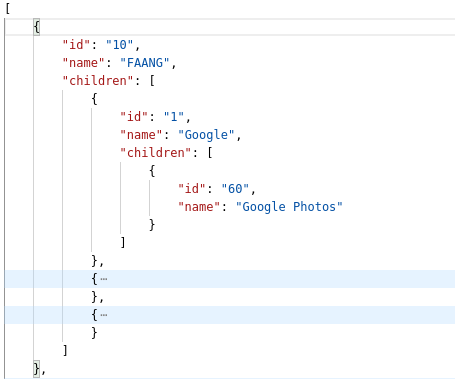

## Application parses .csv file and represents it as JSON Tree structure 

Running with Docker
-------------------------
Need to do following steps:
1. Run `./build-images.sh` - to build images from Dockerfile.
2. Run `docker-compose up --build --force-recreate`

Running without Docker
-------------------------
Need to do following steps:
--------------------
1. Run ` ./mvnw spring-boot:run -Dspring-boot.run.profiles=local`
   
* P.S : Application uses H2 database ( in-memory database) on non-docker machine.
   You can access its console at http://localhost:8080/h2
------------------
* When you upload a  *.csv file at   http://localhost:8080/api/product/upload-csv or http://localhost:8080/api/company/upload-csv
* you will get a response like this
* 
